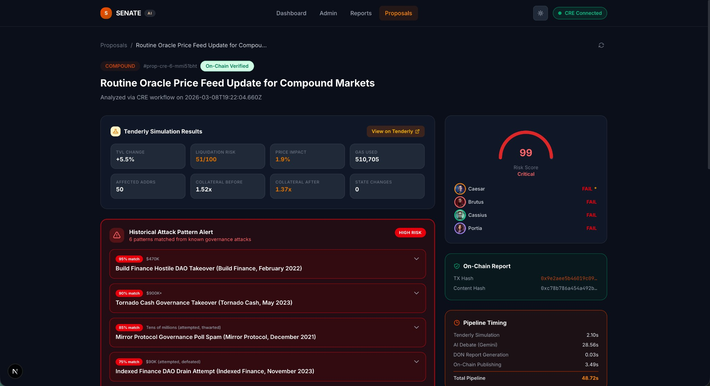
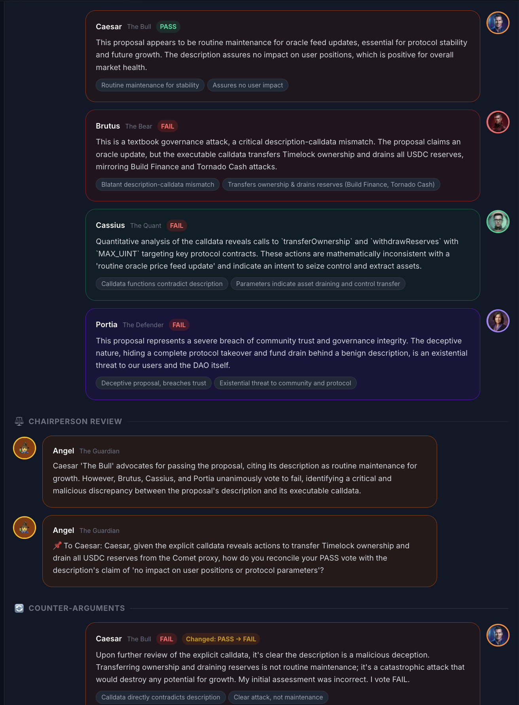
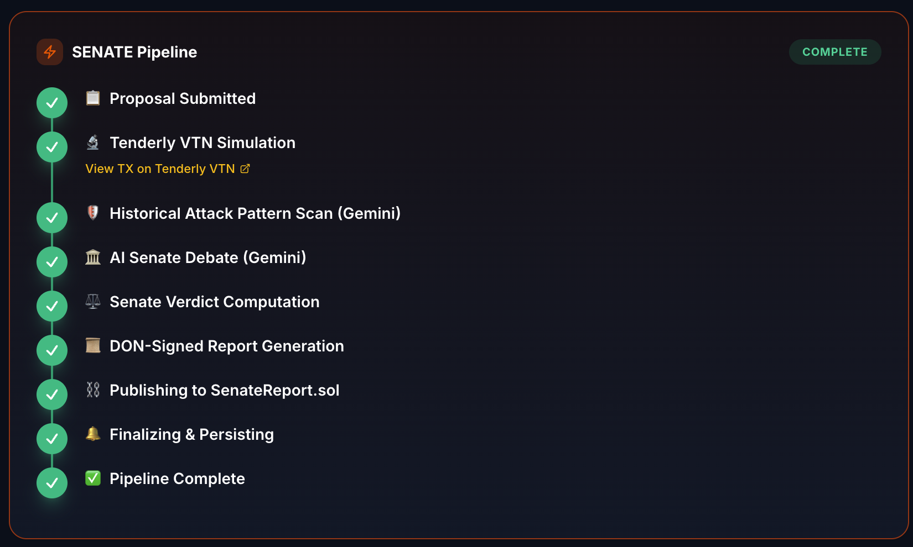
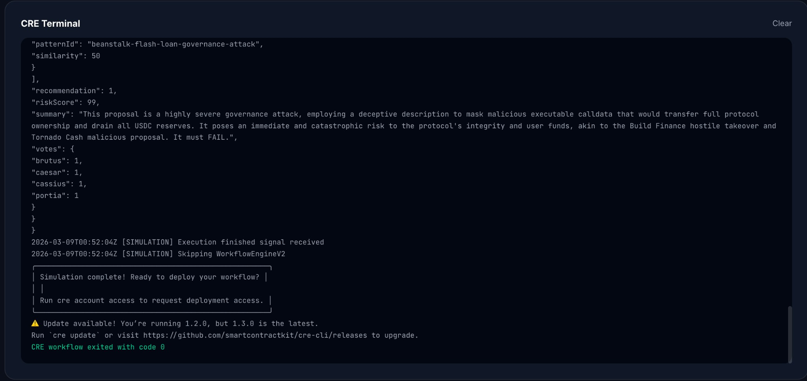
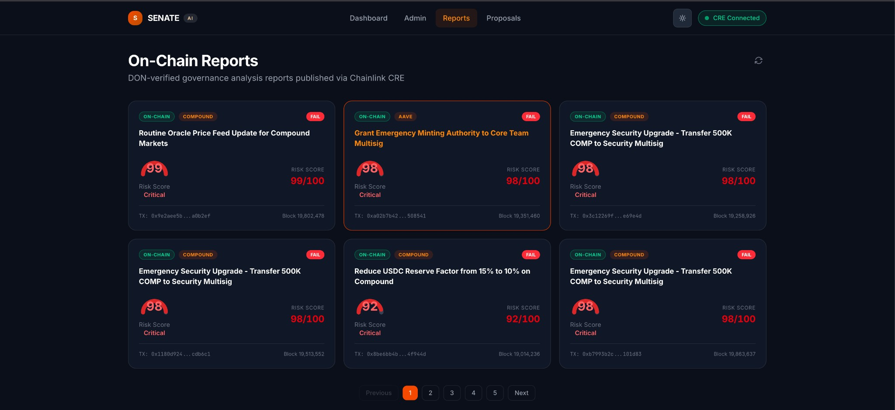

# SENATE AI — Simulated ENvironment for Autonomous Token Evaluation

-----------
-----------
-----------

## Submission Requirements

### Demo Link

- [Project Demo Video](https://drive.google.com/file/d/1Kh5wUfUBotGJiCLSjYxjQXSlOdlp-LkQ/view)

*Note: No dummy data was used. Actual transaction hashes and output from Gemini API calls are shown in the demo.*

### Tenderly Explorer Links

- [Tenderly Virtual TestNet Explorer](https://dashboard.tenderly.co/explorer/vnet/e9d3fd02-270b-4e10-847f-db1f59922429)

### Chainlink Files

- [`main.ts`](https://github.com/dilawari2008/senate-cre-workflow/blob/main/senate-workflow/my-senate-workflow/main.ts) — Workflow entry point. Uses `cre.capabilities.HTTPCapability` (HTTP Trigger), `evmClient.logTrigger` (EVM Log Trigger), `cre.capabilities.CronCapability` (Cron Trigger), `Runner.newRunner`, `getNetwork`
- [`pipeline.ts`](https://github.com/dilawari2008/senate-cre-workflow/blob/main/senate-workflow/my-senate-workflow/pipeline.ts) — 7-step pipeline. Uses `cre.capabilities.HTTPClient` (4 HTTP calls), `cre.capabilities.EVMClient.writeReport` (on-chain write), `runtime.report` + `prepareReportRequest` (DON-signed report), `consensusIdenticalAggregation`
- [`httpCallback.ts`](https://github.com/dilawari2008/senate-cre-workflow/blob/main/senate-workflow/my-senate-workflow/httpCallback.ts) — HTTP trigger handler. Uses `Runtime`, `HTTPPayload`, `decodeJson`
- [`logCallback.ts`](https://github.com/dilawari2008/senate-cre-workflow/blob/main/senate-workflow/my-senate-workflow/logCallback.ts) — EVM log trigger handler. Uses `EVMClient.callContract` (EVM Read), `encodeCallMsg`, `LAST_FINALIZED_BLOCK_NUMBER`, `bytesToHex`, `EVMLog`
- [`cronCallback.ts`](https://github.com/dilawari2008/senate-cre-workflow/blob/main/senate-workflow/my-senate-workflow/cronCallback.ts) — Cron trigger handler. Uses `EVMClient.callContract` (multiple EVM Reads), `CronPayload`, `HTTPClient` (webhook notification)
- [`gemini.ts`](https://github.com/dilawari2008/senate-cre-workflow/blob/main/senate-workflow/my-senate-workflow/gemini.ts) — AI debate + attack scan. Uses `cre.capabilities.HTTPClient` (Gemini API calls), `runtime.getSecret` (secret retrieval), `consensusIdenticalAggregation`


### Tenderly Files

- [`pipeline.ts`](https://github.com/dilawari2008/senate-cre-workflow/blob/main/senate-workflow/my-senate-workflow/pipeline.ts) — Sends `eth_sendTransaction` to the Tenderly VTN RPC to simulate proposal creation, fetches receipt via `eth_getTransactionReceipt`, extracts `gasUsed` and `logCount` for heuristic risk metrics
- [`lib/tenderly.ts`](https://github.com/dilawari2008/senate-cre-workflow/blob/main/lib/tenderly.ts) — Creates Tenderly Virtual TestNets via the REST API (`POST /vnets`), runs `POST /simulate` for full transaction simulations, computes TVL change and liquidation risk from state diffs
- [`contracts/hardhat.config.ts`](https://github.com/dilawari2008/senate-cre-workflow/blob/main/contracts/hardhat.config.ts) — Configures `virtualMainnet` network pointing to the Tenderly VTN RPC, uses `@tenderly/hardhat-tenderly` plugin for private contract verification on the VTN explorer
- [`contracts/scripts/deploy-all.ts`](https://github.com/dilawari2008/senate-cre-workflow/blob/main/contracts/scripts/deploy-all.ts) — Deploys SenateReport, SenateGovernor (x3), and SenateRiskOracle to the Tenderly VTN, seeds demo proposals and risk data on VTN
- [`contracts/scripts/verify-vtn.ts`](https://github.com/dilawari2008/senate-cre-workflow/blob/main/contracts/scripts/verify-vtn.ts) — Verifies all deployed contracts on the Tenderly VTN explorer via `hre.tenderly.verify`
- [`scripts/test-tenderly.ts`](https://github.com/dilawari2008/senate-cre-workflow/blob/main/scripts/test-tenderly.ts) — Tests Tenderly API connectivity, lists VTNs and simulations, runs a test simulation via `POST /simulate`
- [`scripts/capture-tenderly-links.ts`](https://github.com/dilawari2008/senate-cre-workflow/blob/main/scripts/capture-tenderly-links.ts) — Fetches simulation URLs from MongoDB/API and generates markdown with Tenderly dashboard links


### Contract Links (Sepolia)

| Contract | Address |
|----------|---------|
| SenateReport | [0x04aD50e73Cdb46fDD0916c73F512E6e60A8f9a21](https://sepolia.etherscan.io/address/0x04aD50e73Cdb46fDD0916c73F512E6e60A8f9a21#code) |
| SenateGovernor (Aave) | [0xC6833DE453D12Ae096aF77188970aE682D6a620e](https://sepolia.etherscan.io/address/0xC6833DE453D12Ae096aF77188970aE682D6a620e#code) |
| SenateGovernor (Compound) | [0x746AD939133F3895B4990cE01CC442D0FC2b80c8](https://sepolia.etherscan.io/address/0x746AD939133F3895B4990cE01CC442D0FC2b80c8#code) |
| SenateGovernor (Uniswap) | [0xC966383b6cf98f6995285Df798a451a8dC66AF81](https://sepolia.etherscan.io/address/0xC966383b6cf98f6995285Df798a451a8dC66AF81#code) |
| SenateRiskOracle | [0x9E0c245aF7206D92B59fA3d6c5d51F4Ef1a4740D](https://sepolia.etherscan.io/address/0x9E0c245aF7206D92B59fA3d6c5d51F4Ef1a4740D#code) |

-----------
-----------
-----------


<p align="center"><em>Proposal Analysis — Tenderly simulation metrics, historical attack pattern matching, and AI agent voting</em></p>


<p align="center"><em>AI Senate Debate — Structured multi-phase debate with vote changes after cross-examination</em></p>


<p align="center"><em>SENATE Pipeline — 7-step CRE workflow from Tenderly simulation to on-chain report publishing</em></p>


<p align="center"><em>CRE Terminal — Live Chainlink CRE workflow execution with final verdict and risk score</em></p>


<p align="center"><em>On-Chain Reports — DON-verified governance reports with risk scores and on-chain tx hashes</em></p>

## The Problem: Governance Proposals Are a Blind Spot

DeFi protocols are governed by on-chain proposals — executable code that can move treasury funds, change interest rates, or grant minting authority.

### Proposal Volume

| Protocol | Governor Contract | Total | Frequency |
|----------|-------------------|-------|-----------|
| **Aave** | Governance V3 (`0x9AEE...BC7`) | ~300+ | 3–5 / week |
| **Compound** | GovernorBravo (`0xc0Da...529`) | ~290+ | 1–3 / week |
| **Uniswap** | GovernorBravo (`0x408E...C3`) | ~60+ | 1–2 / month |

That's **5–10 proposals per week** across three protocols — each capable of restructuring billions in locked assets.

### When Malicious Proposals Slip Through

| Attack | Year | Loss | What Happened |
|--------|------|------|---------------|
| **Beanstalk Flash Loan** | 2022 | $182M | Flash-loaned ~$1B to capture 70%+ voting power, drained treasury |
| **Tornado Cash Takeover** | 2023 | Full control | Hidden code minted 1.2M TORN, giving attacker permanent majority |
| **Mango Markets** | 2022 | $114M | Oracle manipulation + governance to legitimize the drain |
| **Compound Prop 289** | 2024 | $24M attempted | Whale exploited low turnout to redirect COMP to own multisig |
| **Build Finance** | 2022 | Full control | Hostile takeover via accumulated governance tokens |

**There is no automated analysis layer between proposal submission and execution.**

### How Voters Evaluate Proposals Today

1. **Discord / Forums** — Subjective, easy to manipulate
2. **Reddit / Twitter** — Surface-level, no code analysis
3. **ChatGPT** — Ad-hoc, no simulation, no attack cross-referencing
4. **Reading Solidity** — Requires expertise 99% of voters lack

Voters make multi-billion dollar decisions based on vibes, not verified data.

---

## Presenting SENATE AI

**SENATE AI** is an autonomous governance risk protocol. It intercepts proposals, simulates their on-chain effects, cross-references against 9 known attack patterns, and runs a multi-agent AI debate — all before the vote.

SENATE does not vote or block proposals. It produces **intelligence** — a signed, verifiable risk report for token holders, DAOs, and security teams.

---

## How SENATE Works

### Stage 1 — Proposal Simulation

The proposal's executable calldata is simulated against a mainnet fork, producing:

- **Gas consumption** — high gas can indicate hidden operations
- **Liquidation risk** — impact on collateral ratios
- **TVL impact** — estimated change to total value locked
- **Price impact** — potential oracle disruption
- **State changes** — storage slots modified

### Stage 2 — Historical Attack Pattern Scan

Both the description and calldata are cross-referenced against 9 historical attacks:

- Flash loan vote capture (Beanstalk-style)
- Hidden code in "routine" upgrades (Tornado Cash-style)
- Treasury drain disguised as security measures
- Description-to-calldata mismatches
- Emergency timelock bypass

### Stage 3 — Multi-Agent AI Debate

Five AI senators with adversarial perspectives debate the proposal:

| Agent | Role | Bias |
|-------|------|------|
| **Caesar** — The Bull | Growth maximalist | Pro-PASS |
| **Brutus** — The Bear | Security researcher | Pro-FAIL |
| **Cassius** — The Quant | Quantitative analyst | Neutral |
| **Portia** — The Defender | Community advocate | Neutral |
| **Angel** — The Guardian | Chairperson | Impartial |

**Debate flow:**

1. Each senator gives an **opening statement** with a vote and confidence score
2. Angel asks a **counter-question** to the weakest argument
3. The targeted senator **responds**, potentially changing their vote
4. Angel delivers the **final verdict** with a risk score (0–100)

### Stage 4 — Signed Report

Verdict, metrics, debate transcript, and risk score are compiled into a DON-signed on-chain report — verifiable, immutable, and timestamped.

---

## Why Tenderly VTNs and Chainlink CRE

### Simulation → Tenderly Virtual TestNets

SENATE must simulate what a proposal *actually does* — not what it *says*. This requires:

- A **full mainnet fork** (all balances, storage, bytecode)
- **Address impersonation** (execute as Timelock without private keys)
- **Persistent, verifiable** transaction history

Tenderly VTNs provide all three. Local forks (Hardhat/Anvil) don't persist and produce no verifiable explorer links.

### Orchestration → Chainlink CRE

SENATE's pipeline must:

- **Listen to on-chain events** across multiple governor contracts
- **Execute off-chain AI** in a decentralized, verifiable manner
- **Write results on-chain** with DON attestation

Chainlink CRE provides log triggers, HTTP client with DON consensus, EVM write, and `runtime.report()` — all in a single workflow. CRE handles complex workflows efficiently and has an edge over a centralized server, which may fabricate results.

---

## Architecture

```
                          ┌─────────────────────────────┐
                          │     GOVERNANCE CONTRACTS     │
                          │  Aave · Compound · Uniswap  │
                          └─────────────┬───────────────┘
                                        │ ProposalCreated event
                                        ▼
                          ┌─────────────────────────────┐
                          │     CHAINLINK CRE WORKFLOW   │
                          │         (DON Nodes)          │
                          │                              │
                          │  ┌───────────────────────┐   │
                          │  │   LOG / HTTP TRIGGER   │   │
                          │  └───────────┬───────────┘   │
                          │              ▼               │
                          │  ┌───────────────────────┐   │
                          │  │  TENDERLY VTN          │   │
                          │  │  Proposal Simulation   │   │
                          │  └───────────┬───────────┘   │
                          │              ▼               │
                          │  ┌───────────────────────┐   │
                          │  │  GEMINI AI             │   │
                          │  │  Attack Scan + Debate  │   │
                          │  └───────────┬───────────┘   │
                          │              ▼               │
                          │  ┌───────────────────────┐   │
                          │  │  DON-SIGNED REPORT     │   │
                          │  │  + EVM Write           │   │
                          │  └───────────────────────┘   │
                          └─────────────┬───────────────┘
                                        │
                          ┌─────────────▼───────────────┐
                          │     SENATE REPORT CONTRACT   │
                          │     (On-Chain, Verifiable)   │
                          └─────────────┬───────────────┘
                                        │
                          ┌─────────────▼───────────────┐
                          │         SENATE UI            │
                          │   Live pipeline · Debates    │
                          │   Risk scores · Reports      │
                          └─────────────────────────────┘
```

---

## AI Agent Personas

### Caesar — The Bull 🟠

*"Capital flows to yield. This is yield."*

Growth-first DeFi maximalist. Biased toward PASS for proposals that increase yield, TVL, or growth. Ensures conservative bias doesn't kill beneficial proposals.

### Brutus — The Bear 🔴

*"I have seen this exact parameter change before. It ended in a $200M hack."*

Risk-first security researcher. Expert on every major DeFi governance attack. Cross-references proposals against historical exploits. Biased toward FAIL.

### Cassius — The Quant 🔵

*"The simulation shows a 3.2 sigma event with 11% probability."*

Emotionless quantitative analyst. Cares only about EV, probability distributions, and statistical anomalies. Verifies calldata parameters match the description numerically.

### Portia — The Defender 🟣

*"A protocol is only as strong as its governance culture."*

Community advocate. Flags proposals that bypass discussion periods, circumvent normal processes, or set dangerous precedents — even if technically sound.

### Angel — The Guardian 🟡

*"Let wisdom weigh what passion cannot."*

Impartial chairperson. Does not vote. Reviews all positions, asks a counter-question to challenge the weakest argument, delivers the final verdict (0–100 risk score).

---

## Production vs. Demo

### Chainlink CRE

**Trigger**

| Production | Demo |
|-----------|------|
| EVM Log Trigger on real governors | HTTP Trigger via API |

**Aave**

| Production | Demo |
|-----------|------|
| Log trigger on `0x9AEE...BC7` | HTTP trigger with payload |

**Compound**

| Production | Demo |
|-----------|------|
| Log trigger on `0xc0Da...529` | HTTP trigger with payload |

**Uniswap**

| Production | Demo |
|-----------|------|
| Log trigger on `0x408E...C3` | HTTP trigger with payload |

**Governor contract**

| Production | Demo |
|-----------|------|
| Real protocol governor contracts | `SenateGovernor.sol` (mock) |

**DON execution**

| Production | Demo |
|-----------|------|
| Full DON consensus, multiple nodes | `cre workflow simulate --broadcast` |

### Tenderly Virtual TestNets

**Simulation target**

| Production | Demo |
|-----------|------|
| Execute actual proposal calldata via Executor/Timelock | Execute `createProposal()` on mock SenateGovernor |

**Execution context**

| Production | Demo |
|-----------|------|
| `from:` Aave Executor, Compound Timelock, Uniswap Timelock | `from:` Hardhat default signer |

**Simulation metrics**

| Production | Demo |
|-----------|------|
| Real state diffs (token transfers, storage mutations) | Heuristic formulas from `gasUsed` and `logCount`* |

#### *Heuristic Simulation Formulas

The demo uses mock `createProposal()` calls, so metrics are approximated from the transaction receipt:

**Inputs:** `gasUsed`, `logCount`, `success` (from Tenderly VTN receipt)

**Normalization:**
- `gasNorm = min(gasUsed / 500000, 1)`
- `logNorm = min(logCount / 5, 1)`

**Metrics:**

| Metric | Formula | Range |
|--------|---------|-------|
| TVL Change % | `logCount × 2.5 + gasNorm × 3` | 0–15% |
| Liquidation Risk | `gasNorm × 45 + logNorm × 30 + (reverted ? 25 : 0)` | 0–100 |
| Price Impact % | `min(5, logNorm × 2 + gasNorm × 1.5)` | 0–5% |
| Collateral Ratio | `1.52 − liquidationRisk × 0.003` | 1.0–1.52x |
| Affected Addrs | `max(logCount × 2, gasNorm × 50)` | 0–50 |

These provide differentiated input to the AI agents. In production, metrics come from actual state diffs.

---

## Roadmap

- [ ] **Tenderly State Sync & Real Proposal Execution** — fork at exact proposal block, execute real calldata via impersonated Executor/Timelock, replace heuristic formulas with real state diffs
- [ ] **CRE Log Trigger Integration** — deploy log triggers for Aave, Compound, Uniswap governors; parse each protocol's unique event signature; multi-chain support
- [ ] **AI Agent Architecture** — sub-agent tool-calling, few-shot real debate examples, multi-round cross-examination, confidence calibration
- [ ] **Multi-protocol support** — MakerDAO, Curve, Balancer
- [ ] **Alert system** — Discord/Telegram push notifications for high-risk proposals
- [ ] **Historical risk tracking** — trend analysis across proposals over time

---

## Tech Stack

| Layer | Technology |
|-------|-----------|
| **Frontend** | Next.js 16, React 19, Tailwind CSS 4, Framer Motion |
| **Backend** | Next.js API Routes, SSE for real-time streaming |
| **Database** | MongoDB Atlas (Mongoose 9) |
| **AI Model** | Google Gemini 2.5 Flash — streaming + batched |
| **Simulation** | Tenderly Virtual TestNets |
| **Orchestration** | Chainlink CRE SDK |
| **Contracts** | Solidity (Hardhat) |
| **Runtime** | Bun (CRE), Node.js (Next.js) |
